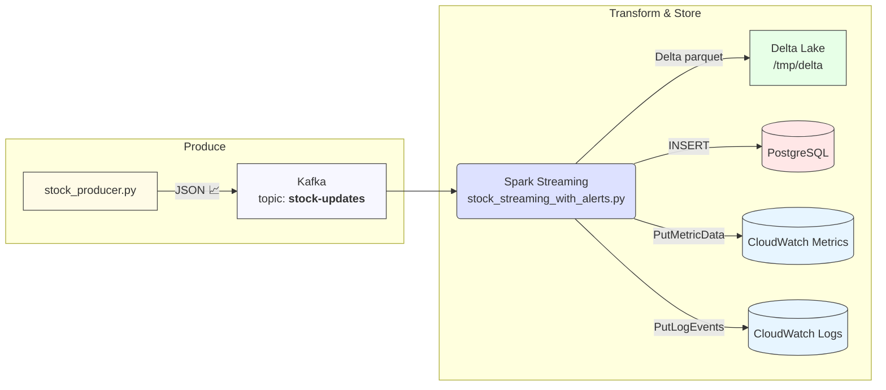

# Realtime Stock-Pipeline &nbsp;
[](LICENSE) 
[](https://docs.docker.com/)

>**Kafka × Spark Structured Streaming × Delta Lake × PostgreSQL × AWS CloudWatch**
> A fully-containerised data pipeline that ingests live market prices, enriches them in Spark, persists them in Delta Lake **and** PostgreSQL, and raises CloudWatch alerts when intraday price movements break configured thresholds.

---

## ️🚀 Quick-start

```bash
# 1. Clone and switch into the repo
git clone https://github.com/<you>/realtime-stock-pipeline.git
cd realtime-stock-pipeline

# 2. Create an .env with your AWS creds (NEVER commit this!)
cat <<EOF > .env
AWS_ACCESS_KEY_ID=AKIAXXXXXXXXXXXX
AWS_SECRET_ACCESS_KEY=xxxxxxxxxxxxxxxxxxxxxxxxxxxxxxxxxxxx
AWS_REGION=us-east-2
EOF

# 3. Spin everything up
docker compose up --build     # ^C to stop
docker compose down -v        # tear-down & clear volumes
```
The first start downloads all images, builds the stock_producer container and creates the Delta Lake & Postgres volumes. Subsequent starts are instant.

---

## 🗺️ End-to-end flow



---

## 🧩 Component glossary

| Container           | Image / Code                                                   | Purpose                                                                                                   |
| ------------------- | -------------------------------------------------------------- | --------------------------------------------------------------------------------------------------------- |
| **zookeeper**       | `cp-zookeeper:7.3`                                             | Metadata quorum for Kafka                                                                                 |
| **kafka**           | `cp-kafka:7.3`                                                 | Event backbone – topic **`stock-updates`**                                                                |
| **stock\_producer** | `Dockerfile.producer` + `producer/*.py`                        | Pulls live prices (or mocks) & pushes JSON messages to Kafka                                              |
| **spark**           | `bitnami/spark:3.4.1` + `spark/stock_streaming_with_alerts.py` | Reads Kafka → calculates deltas → writes **Delta Lake** on local disk, forwards CloudWatch metrics & logs |
| **postgres**        | `postgres:13`                                                  | Relational sink (optional: run `delta_to_postgres.py` to load historic data)                              |

---

## 📂 Repository layout

```
.
├─ docker-compose.yml
├─ Dockerfile.producer
├─ producer/
│  ├─ stock_producer.py
│  └─ requirements.txt
├─ spark/
│  ├─ stock_streaming_with_alerts.py   ←  **current streaming job**
│  ├─ stock_streaming.py               ←  _legacy; kept for reference_
│  └─ ...
├─ delta_to_postgres.py
└─ misc / diagrams / notes
```

---

## 📂 Repo layout & "unused" files

Files currently not used in the live stack
| Path                        | Why it exists                                                                                                                                                         |
| --------------------------- | --------------------------------------------------------------------------------------------------------------------------------------------------------------------- |
| `spark/stock_streaming.py`  | Initial prototype before alerting & CloudWatch integration were merged into `stock_streaming_with_alerts.py`. Safe to delete once you no longer need the example.     |
| `compare_stock_movement.py` | Stand-alone tester for relative-move logic; replaced by inline UDFs in the streaming job.                                                                             |
| `kafka/init-topic.sh`       | Convenience script for creating the topic manually; the producer now auto-creates topics.                                                                             |
| `AWSCLIV2.pkg`              | Local installer that **is not required** inside Docker; left here only if you need to install the AWS CLI on macOS. Delete it to avoid pushing a 40 MB binary to Git. |
| `realtime_data_flow` image  | Optional architecture PNG used in the README badge. Remove if you host diagrams elsewhere.                                                                            |

---

## ⚙️ Configuration

| Variable                | Location                               | Default     | Description                                                     |
| ----------------------- | -------------------------------------- | ----------- | --------------------------------------------------------------- |
| `PRICE_MOVE_PCT`        | `spark/stock_streaming_with_alerts.py` | `2`         | %-threshold that triggers a CloudWatch alert.                   |
| `AWS_ACCESS_KEY_ID`     | `.env / shell env`                     | —           | IAM user or STS key (CloudWatch → PutMetricData, PutLogEvents). |
| `AWS_SECRET_ACCESS_KEY` | `.env / shell env`                     | —           | Corresponding secret.                                           |
| `AWS_REGION`            | `.env / compose`                       | `us-east-2` | Region for logs & metrics.                                      |

---

## 🔍 Observability & testing

### 1.) Tail Kafka quickly

| What           | How                                                                                                                                                                                |
| -------------- | ---------------------------------------------------------------------------------------------------------------------------------------------------------------------------------- |
| **Tail Kafka** | <br>`docker exec -it $(docker compose ps -q kafka) \`<br>`  kafka-console-consumer --bootstrap-server kafka:9092 \`<br>`  --topic stock-updates --from-beginning --max-messages 5` |
| **Spark UI**   | [http://localhost:4040](http://localhost:4040) (while Spark container is running)                                                                                                  |
| **CloudWatch** | Logs ➜ `/realtime-stock/alerts`  ·  Metrics ➜ `RealtimeStock › PriceMovePct`                                                                                                       |
| **Dashboards** | Add the two widget queries shown later in this README                                                                                                                              |

---

## ⌨️ Common commands

| Goal                  | Command                        |
| --------------------- | ------------------------------ |
| start pipeline        | `docker compose up --build`    |
| stop & wipe volumes   | `docker compose down -v`       |
| restart Spark only    | `docker compose restart spark` |
| prune dangling images | `docker image prune -f`        |

---

## 📈 Extending the pipeline ideas

| Idea                   | Hint                                                                             |
| ---------------------- | -------------------------------------------------------------------------------- |
| **S3 Delta Lake**      | add `--packages io.delta:delta-storage-s3_2.12:2.4.0` & use `s3a://bucket/delta` |
| **Slack / SNS alerts** | call `boto3.client('sns').publish()` inside `alert_and_write_to_delta()`         |
| **Airflow DAG**        | separate producer & Spark into tasks; add back-fill DAG                          |
| **Athena / Redshift**  | Glue crawler on S3 Delta or unload Parquet to Redshift Serverless                |

---

## 🛡️ Security notes

IAM policy least privilege: logs:CreateLogGroup, logs:CreateLogStream, logs:PutLogEvents, cloudwatch:PutMetricData.
Never commit .env or any secret file. .gitignore already covers it.
If you publish the repo, consider removing AWSCLIV2.pkg, .DS_Store and other local artefacts to keep image size & clone time small.

---

## ✒️ Author

**Derek Acevedo** – [GitHub](https://github.com/poloman2308) | [Linkedin](https://linkedin.com/in/derekacevedo86)

```r

### Why the Mermaid block failed before
GitHub needs:

1. A blank line before the ```mermaid fence.
2. The language tag exactly `mermaid` (no extra hashes).
3. No leading `##` heading on the same line as the fence.

The snippet above satisfies all three, so the diagram should render on the repo homepage after you push.
```
